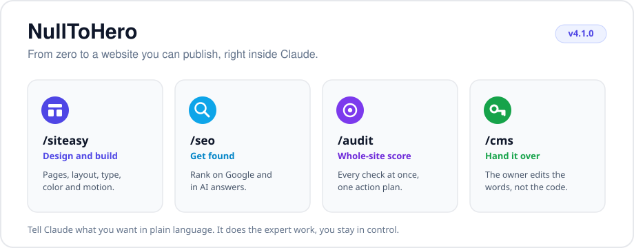

<div align="center">

# NullToHero



**Build a website you are proud of, even if you have never written a line of code.**

[](https://github.com/MariusYvard/NullToHero/releases)
[](LICENSE)
[](https://github.com/MariusYvard/NullToHero/actions/workflows/validate.yml)
[](https://github.com/MariusYvard/NullToHero)

**v1.22.0** · 4 skills · 59 commands · 101 reference docs · 14 audit sub-agents

</div>

NullToHero is an add-on for Claude. Install it once, then ask Claude in plain language to design your pages, get them ranking on Google, and check them for problems before you publish. Claude does the expert work, you stay in control.

<div align="center">
  <picture>
    <source media="(prefers-color-scheme: dark)" srcset="docs/demo-dark.gif">
    
  </picture>
</div>

<div align="center">

[What it is](#what-is-nulltohero) · [Pick your goal](#pick-your-goal) · [Install](#install) · [Skills](#the-four-skills) · [Compare](#how-nulltohero-compares) · [Workflow](#how-a-project-flows) · [Assets](#ready-made-assets)

</div>

---

## What is NullToHero

Claude already writes code. NullToHero gives it the taste and the checklists of a senior web team: a designer, an SEO specialist, a quality inspector, and a reviewer who looks at the whole site at once.

You do not learn commands by heart. You say what you want ("make this landing page look more premium", "why am I not on Google", "is this ready to ship"), and Claude picks the right tool. The sections below show what each tool produces so you know what to expect.

---

## Pick your goal

| I want to | Type this | What you get back |
|-----------|-----------|-------------------|
| Start a brand-new site | `/siteasy setup` then `/siteasy build` | A brand file, then a styled, responsive first page |
| Make a page look more professional | `/siteasy amplify index.html` | Stronger type, color and spacing, same content |
| Be found on Google | `/seo audit yoursite.com` | A scored report and a prioritized action plan |
| Add Google rich results | `/seo schema yoursite.com` | Valid Schema.org JSON-LD, ready to paste |
| Show up in AI answers (ChatGPT, Perplexity) | `/seo geo yoursite.com` | A visibility score with per-engine fixes |
| Catch problems before publishing | `/inspect detect index.html` | A checklist of issues, each with its fix |
| See it the way a real browser does | `/inspect preview index.html` | Desktop and mobile screenshots, bugs fixed in a loop |
| Check the whole site in one pass | `/audit yoursite.com` | One site health score and one merged action plan |

---

## Install

NullToHero is a Claude Code plugin and a marketplace in one repository.

**A. From the marketplace (recommended, auto-updates)**

```
/plugin marketplace add MariusYvard/NullToHero
/plugin install null-to-hero@null-to-hero-marketplace
```

Later, pull new releases with `/plugin marketplace update null-to-hero-marketplace`.

<details>
<summary><b>Manual install (macOS, Linux, Windows)</b></summary>

**B. Manual install (macOS, Linux)**

```bash
git clone https://github.com/MariusYvard/NullToHero.git
bash NullToHero/install.sh
```

**C. Manual install (Windows PowerShell)**

```powershell
git clone https://github.com/MariusYvard/NullToHero.git
powershell -ExecutionPolicy Bypass -File NullToHero/install.ps1
```

> [!WARNING]
> A one-liner (`bash <(curl -fsSL https://raw.githubusercontent.com/MariusYvard/NullToHero/main/install.sh)`) also works, but it runs a remote script directly. Clone and read `install.sh` first if you want to inspect it.

</details>

> [!TIP]
> The short forms `/siteasy`, `/seo`, `/inspect` and `/audit` work as long as no other plugin claims the same name. If you run several plugins, use the namespaced form `/null-to-hero:siteasy`.

---

## The four skills

<table>
<tr>
<td valign="top" width="50%">

<br>
**Design and build.** Plan, build, make it responsive, add motion.<br>
`/siteasy build` · `/siteasy amplify` · `/siteasy tokens`

</td>
<td valign="top" width="50%">

<br>
**Get found.** Audit, structured data, sitemaps, AI-search visibility.<br>
`/seo audit` · `/seo schema` · `/seo geo`

</td>
</tr>
<tr>
<td valign="top" width="50%">

<br>
**Check before you publish.** Anti-pattern scan, browser preview, code review.<br>
`/inspect detect` · `/inspect preview` · `/inspect review`

</td>
<td valign="top" width="50%">

<br>
**Whole site in one pass.** Every specialist at once, one score, one action plan.<br>
`/audit` · `/audit verify` · `/audit compare`

</td>
</tr>
</table>

###  Design and build

Your design partner. It plans the look, builds the pages, fixes spacing and type, makes everything responsive, and adds tasteful motion. You describe the goal, it produces real, production-ready front-end.

<details>
<summary><b>All 26 commands</b></summary>

| Command | What it does |
|---------|-------------|
| `build [feature]` | Build a full UI feature end to end from a confirmed brief |
| `plan [feature]` | Plan UX and visual direction before any code |
| `research [scope]` | UX research planning, method choice, persona and journey synthesis |
| `ia [target]` | Information architecture, card sorting, tree testing, navigation |
| `journey [persona]` | Empathy maps, journey maps, service blueprints |
| `setup` | Create PRODUCT.md (brand, audience, tone, anti-references) |
| `critique [target]` | Design review with heuristic scoring |
| `audit [target]` | Quality checks (accessibility, performance, responsive, WCAG 2.2, images, forms) |
| `polish [target]` | Final quality pass before shipping |
| `amplify [target]` | Make bland designs bolder (type, color, presence) |
| `simplify [target]` | Reduce visual noise, strip to the essentials |
| `animate [target]` | Purposeful motion and micro-interactions |
| `typeset [target]` | Typography audit, font selection, hierarchy |
| `layout [target]` | Spacing systems, visual rhythm, grid |
| `adapt [target]` | Mobile, tablet, desktop and print adaptation |
| `mobile [target]` | Phone ergonomics: thumb zone, touch targets, keyboards, mobile audit |
| `clarify [target]` | UX copy, error messages, button labels, empty states |
| `onboard [target]` | First-run flows, empty states, feature discovery |
| `delight [target]` | Micro-interactions, personality, satisfying feedback |
| `launch [target]` | Production hardening and Core Web Vitals |
| `overdrive [target]` | View Transitions API, WebGL, scroll-driven animation |
| `parallax [target]` | Multi-layer depth, scrollytelling, WCAG 2.2.2 motion safety |
| `document` | Generate DESIGN.md from existing project code |
| `extract [target]` | Pull reusable tokens and components into a design system |
| `tokens [project]` | Audit or create a two-layer CSS token system |
| `live [target]` | Interactive in-browser variant mode (bundled helper and picker) |

Common runs: a new page (`setup` → `plan` → `build` → `layout` → `adapt` → `amplify` → `launch`), a refresh (`critique` → `amplify` → `polish`), a design system (`document` → `extract` → `tokens`).

</details>

###  Get found

Your search expert. It audits a whole site or a single page, writes the structured data Google wants, builds sitemaps, and checks how visible you are in AI answers.

<details>
<summary><b>All 19 commands</b></summary>

| Command | What it does |
|---------|-------------|
| `audit [url]` | Full site audit, crawls up to 500 pages, scores 7 dimensions, outputs ACTION-PLAN.md |
| `page [url]` | Deep single-page analysis (title, meta, headings, schema, images, content score) |
| `plan [business-type]` | Full strategy (architecture, content pillars, keyword plan, 4-phase roadmap) |
| `technical [url]` | Robots.txt, sitemaps, Core Web Vitals, mobile, security headers, AI crawlers |
| `schema [url]` | Detect, validate and generate Schema.org JSON-LD |
| `content [url]` | E-E-A-T, readability, keyword density, AI citation readiness |
| `geo [url]` | Weighted visibility score across Google AIO, ChatGPT, Perplexity, Bing Copilot (sub-modes `geo quick`, `geo compare`) |
| `sitemap [url\|generate]` | XML sitemap validation and generation |
| `images [url]` | Image SEO (alt text, formats, lazy loading, CLS, LCP) |
| `local [url]` | Local SEO (Google Business Profile, NAP, citations, reviews, LocalBusiness schema) |
| `hreflang [url\|generate]` | Hreflang validation and generation |
| `programmatic [url\|plan]` | Programmatic SEO with quality gates |
| `competitor-pages [url\|generate]` | Comparison and alternatives pages with feature matrices |
| `cluster [keyword]` | Semantic keyword clustering and content architecture |
| `sxo [url]` | Search Experience Optimization (intent alignment, satisfaction signals) |
| `drift [url] baseline\|compare\|history` | SEO drift monitoring over time |
| `backlinks [url]` | Backlink profile analysis |
| `ecommerce [url]` | E-commerce SEO (products, categories, faceted navigation) |
| `report [url\|file\|generate]` | Format audit output as a Markdown deliverable or PDF |

Common runs: new site (`plan` → build → `technical` → `schema` → `sitemap` → `audit` → `report`), existing site (`audit` → `technical` → `content` → `geo` → `backlinks`), a page that will not rank (`page` → `content` → `schema` → `sxo`), local business (`local` → `schema` → `geo`), before a redesign (`drift baseline` → redesign → `drift compare`).

</details>

###  Check before you publish

Your quality gate. Three quick checks to run before you ship.

<details>
<summary><b>All 3 commands</b></summary>

| Command | What it does |
|---------|-------------|
| `detect [target]` | Deterministic problem scan (focus rings, touch targets, reduced-motion, WCAG 2.2, images, forms) |
| `preview [target]` | Real Chromium screenshot (desktop and mobile), reads it back, fixes bugs in a loop |
| `review [file]` | Design engineering code review (motion issues, accessibility, Before and After table with a score) |

Common runs: before every ship (`detect` → `preview` → `review`).

</details>

###  The whole site in one pass

Runs every specialist at once across search, defects and design, then merges everything into one score and one action plan ordered by priority. The orchestration is documented in [docs/ARCHITECTURE.md](docs/ARCHITECTURE.md).

<details>
<summary><b>All 9 commands</b></summary>

| Command | What it does |
|---------|-------------|
| `full [url]` | All 14 sub-agents (SEO, defects, design), unified report and prioritized action plan |
| `seo [url]` | Search-visibility group only (5 SEO sub-agents) |
| `defects [url]` | Front-end defect group only (4 inspect sub-agents) |
| `design [url]` | Design-quality group only (4 siteasy sub-agents) |
| `quick [url]` | One representative sub-agent per group for a fast triage |
| `checks [url]` | Deterministic pre-pass: computed checks and `SITE-AUDIT.json`, no sub-agents (powers the CI gate) |
| `verify [url]` | Consensus re-check of the gating dimensions (a11y, interaction, technical) by majority vote |
| `compare [A] [B]` | Diff two targets: per-check verdict changes and score deltas (before/after, or A vs B) |
| `report [file]` | Format an existing audit into a client-ready report or PDF |

The deterministic pre-pass behind `checks` fetches the page once (optionally rendering a client-rendered SPA with Playwright), computes the objectively decidable verdicts (contrast, image dimensions, viewport, robots.txt, headings, lang, title, description, 375px overflow) and writes a machine-readable `SITE-AUDIT.json`. That JSON powers a structural `compare`, score-over-time, and a CI gate you can drop into any repo as a GitHub Action (`uses: MariusYvard/NullToHero@v1.14.0`). See [docs/ARCHITECTURE.md](docs/ARCHITECTURE.md) and [tools/audit/README.md](tools/audit/README.md). To analyze a live site in the browser with Claude, see [docs/CLAUDE-IN-CHROME.md](docs/CLAUDE-IN-CHROME.md).

Common runs: a full pass (`audit`), a consensus re-check (`audit verify`) or a before and after diff (`audit compare`).

</details>

---

<details>
<summary><b>See sample output</b></summary>

A theme from `/siteasy tokens`, a drop-in `:root` stylesheet with WCAG-checked tokens:

```css
:root {
  --bg: #0B0B0C;
  --surface: #161618;
  --fg: #F5F5F4;
  --accent: #6E56CF;     /* on-accent 5.2:1, passes AA */
  --ring: #6E56CF;
  --text-lg: clamp(1.25rem, 1.1rem + 0.6vw, 1.6rem);
}
```

Structured data from `/seo schema`, valid Schema.org JSON-LD ready to paste:

```json
{
  "@context": "https://schema.org",
  "@type": "Organization",
  "name": "Example",
  "url": "https://example.com",
  "logo": "https://example.com/logo.png"
}
```

An action plan from `/audit`, ordered by severity:

```md
## Action plan

### Critical
- Contrast 3.1:1 on the hero CTA. Raise the accent or darken the label.

### High
- LCP 3.8s. Preload the hero image and set fetchpriority="high".

### Medium
- Heading order skips from H2 to H4. Renumber the section.
```

</details>

---

## How NullToHero compares

NullToHero overlaps three kinds of tool and differs from each in scope. The table sets out who does what.

| Capability | NullToHero | Design-intelligence skill (ui-ux-pro-max) | Design-methodology skill | In-browser UI generator (v0, Lovable) |
|---|---|---|---|---|
| Design and build pages | Yes | Partial (a system, not pages) | No (process, not code) | Yes |
| Generate tokens and a design system | Yes | Yes | No (documents only) | Partial |
| Defect scan (accessibility, layout, motion) | Yes | No | Partial (manual critique) | No |
| SEO and structured data | Yes | No | No | No |
| AI-search visibility (GEO) | Yes | No | No | No |
| Whole-site audit in one pass | Yes | No | No | No |
| Deterministic 0-100 score | Yes | No | No | No |
| Code-quality review of the output | Yes | No | No | No |
| Runs inside Claude on your own files | Yes | Yes | Yes | No (hosted) |

NullToHero is the one that spans build, defects, SEO and a scored whole-site audit in a single plugin. It is not a hosted product or a visual editor: it runs inside Claude and edits the real files in your project, so the output is yours to keep and version.

---

## How a project flows

```
/siteasy research       understand the users
/siteasy ia             validate the structure
/siteasy journey        map empathy and journeys
/siteasy setup          define brand, audience, tone
/siteasy plan           plan UX before coding
/seo plan               build the SEO strategy in parallel
/seo cluster            group keywords by intent
     |
/siteasy build          build the interface
/siteasy tokens         set up the token system
/siteasy layout         fix spacing and rhythm
/siteasy adapt          make it responsive
/siteasy mobile         tune phone ergonomics
     |
/siteasy amplify        make it beautiful
/siteasy simplify       strip to the essence
/siteasy typeset        refine the typography
/siteasy animate        add motion
/siteasy delight        add micro-interactions
/siteasy clarify        sharpen the copy
     |
/inspect detect         catch anti-patterns
/inspect preview        see it in a real browser
/siteasy critique       heuristic UX review
/inspect review         final code-quality gate
/siteasy polish         last quality pass
     |
/seo audit              full SEO check
/seo technical          crawl and render health
/seo schema             add structured data
/seo content            E-E-A-T and readability
/seo images             image SEO
/seo geo                AI-search visibility
     |
/siteasy launch         harden for production
/seo report             client-ready report
/seo drift              watch for regressions
```

> [!TIP]
> In a hurry, `/audit yoursite.com` runs the whole check in a single pass.

---

<details>
<summary><b>Set up your project</b></summary>

NullToHero works best with two small files in your project root. Claude reads them so its output matches your brand.

- `PRODUCT.md`, who your users are, your brand, tone and anti-references. Create it with `/siteasy setup`.
- `DESIGN.md`, your colors, typography and components. Generate it with `/siteasy document`.

</details>

---

## Ready-made assets

The `assets/` folder ships an original, license-clean starter library: 139 icons, 20 background patterns, 18 spot illustrations, 34 animations and 6 templates. Icons and patterns take the surrounding color and the animations honor `prefers-reduced-motion`. Everything is CC0 for the media and MIT for the templates, so it is safe to copy into any project. Open `assets/gallery.html` to browse the whole set, and `assets/README.md` for how to wire each kind in. During a build, `/siteasy build` pulls from this library before an external source.

## What is inside

NullToHero ships **101 reference docs** that Claude loads only when it needs them, so a large project does not eat your context budget.

<details>
<summary>See the full knowledge base</summary>

**siteasy, design (54):** accessibility-engineering, adapt, animate, animation-engineering, assets-library, audit, bolder, brand, clarify, cognitive-load, color-and-contrast, colorize, component-patterns, craft, creative-patterns, critique, css-architecture, dark-mode-engineering, delight, design-tokens, distill, document, extract, form-patterns, gestalt, harden, heuristics-scoring, image-strategy, information-architecture, inspiration, interaction-design, journey-mapping, layout, live, mobile-ergonomics, motion-design, onboard, optimize, overdrive, parallax, personas, polish, product, quieter, responsive-design, shape, spatial-design, teach, tokens, typeset, typography, ux-research, ux-writing, wcag-2-2

**seo, search (20):** action-plan, audit, backlinks, cluster, competitor-pages, content, drift, ecommerce, geo, hreflang, images, local, page, plan, programmatic, report, schema, sitemap, sxo, technical

**seo, plan assets (6):** agency, ecommerce, generic, local-service, publisher, saas

**inspect, defects (3):** detect, preview, review

**audit, whole-site (4):** checks, compare, full, report

A stack-aware design-system generator also lives under `tools/design-system/`, covering 16 technology stacks (React, Next.js, Vue, Svelte, Astro, Nuxt, Angular, Laravel, HTML and Tailwind, shadcn/ui, SwiftUI, React Native, Flutter, Jetpack Compose, Three.js, Nuxt UI).

</details>

---

<details>
<summary><b>Requirements</b></summary>

- **Node.js**, for `/inspect preview`, `/inspect detect` and the validator (`tests/validate.js`).
- **Playwright**, installed on first `/inspect preview` run.
- **Python 3**, for the design-system generator (`/siteasy setup`) and the Python tests.

</details>

---

## Project

- Changes by version: [CHANGELOG.md](CHANGELOG.md)
- How to contribute: [CONTRIBUTING.md](CONTRIBUTING.md)
- Reporting a vulnerability: [SECURITY.md](SECURITY.md)
- Credits and third-party licenses: [ATTRIBUTION.md](ATTRIBUTION.md), [NOTICE](NOTICE)

```bash
node tests/validate.js   # run before opening a PR
```

---

<div align="center">

Built by [Marius Yvard](https://lecvdemarius.netlify.app/) · [Releases](https://github.com/MariusYvard/NullToHero/releases) · [Changelog](CHANGELOG.md) · [Contributing](CONTRIBUTING.md)

License: Apache 2.0. See [LICENSE](LICENSE).

</div>
