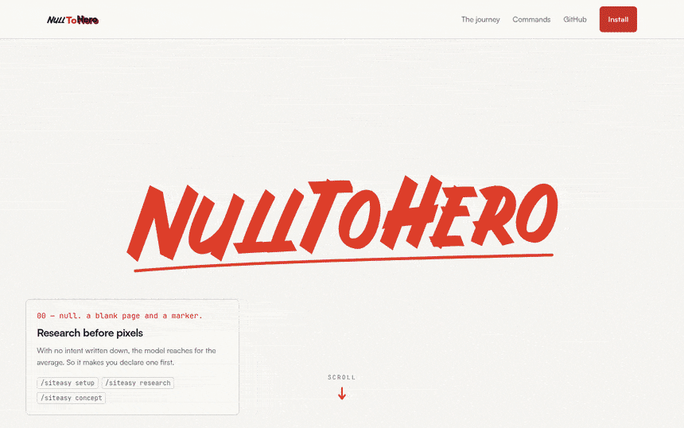
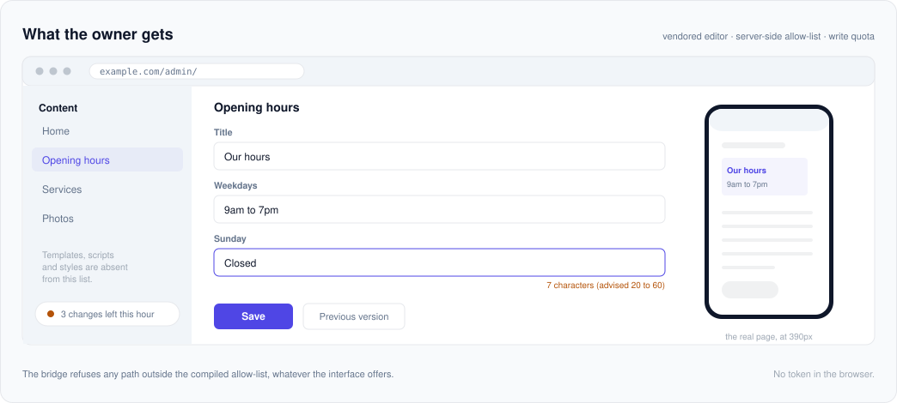
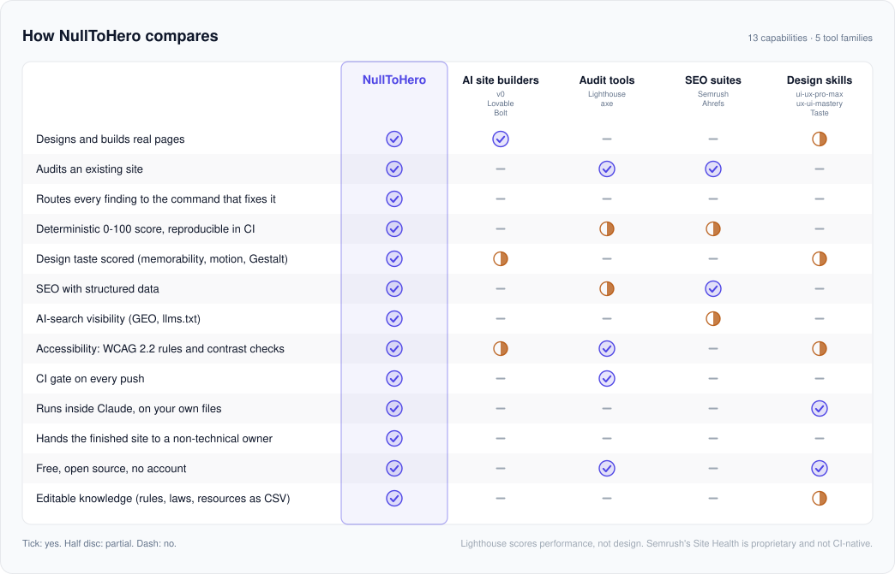

<div align="center">

<picture>
  <source media="(prefers-color-scheme: dark)" srcset="docs/banner-dark.svg">
  
</picture>

# NullToHero

**Build a website you are proud of, even if you have never written a line of code.**

[](https://github.com/MariusYvard/NullToHero/releases)
[](LICENSE)
[](https://github.com/MariusYvard/NullToHero/actions/workflows/validate.yml)
[](https://github.com/MariusYvard/NullToHero)

**v4.0.0** · 4 skills · 67 commands · 135 reference docs · 15 audit sub-agents

</div>

NullToHero is an add-on for Claude. Install it once, then ask Claude in plain language to design your pages, get them ranking on Google, judge the whole site before you publish, and hand the finished thing to the person who owns it. Claude does the expert work, you stay in control.

<div align="center">
  <picture>
    <source media="(prefers-color-scheme: dark)" srcset="docs/demo-dark.gif">
    
  </picture>
</div>

<div align="center">

[What it is](#what-is-nulltohero) · [See it built](#see-what-it-builds) · [Pick your goal](#pick-your-goal) · [Install](#install) · [Skills](#the-skills) · [Compare](#how-nulltohero-compares) · [Workflow](#how-a-project-flows) · [Assets](#ready-made-assets)

</div>

---

## What is NullToHero

Claude already writes code. NullToHero gives it the taste and the checklists of a senior web team: a designer, an SEO specialist, a reviewer who judges the whole site at once, and the person who hands the keys to its owner.

<p align="center">
  
</p>

You do not learn commands by heart. You say what you want ("make this landing page look more premium", "why am I not on Google", "is this ready to ship"), and Claude picks the right tool. The sections below show what each tool produces so you know what to expect.

---

## See what it builds

[**nulltohero.netlify.app**](https://nulltohero.netlify.app) is the plugin's own site, and
it is the honest answer to "what can I actually get out of this". Nothing on it is a
mockup: it is a scroll-driven story that writes the logo onto a blank sheet, opens a
terminal, raises a generic template page, then audits that page on screen and corrects it.

<!--
  No dark twin for this one, and that is not an oversight. Every other figure in
  this README ships a light and a dark file because it is drawn to sit on the
  reader's page. This one is a recording of a site that has no light mode:
  measured under both colour schemes, nulltohero.netlify.app computes the same
  background and the same ink, and no stylesheet it serves carries a
  prefers-color-scheme rule. A "showcase-site-dark.gif" would be the same
  2.4 megabytes twice.
-->
<div align="center">
  <a href="https://nulltohero.netlify.app">
    
  </a>
  <br>
  <sub><a href="https://nulltohero.netlify.app">Open the live version</a>: the motion is scroll-driven, so it answers your wheel rather than a timer, and the capture above only walks it at one fixed pace</sub>
</div>

The site holds itself to the rules it ships. Its source carries the plugin's own audit
annotations: where a low-contrast element is deliberate, it declares
`data-contrast-exempt-reason` and says why, which is the same mechanism `/audit` reads
when it decides whether a contrast finding is a defect or a documented exception. The one
place it shows unreadable text on purpose is the specimen page being audited, and that is
written down in the code rather than left for a reviewer to guess.

You can check the claim rather than take it:

```bash
node null-to-hero/tools/audit/gate.mjs https://nulltohero.netlify.app/ --min-score 90
#   deterministic score: 100/100   FAIL: 0   WARN: 0   critical FAIL: 0
#   RESULT: PASS
```

### How it was built

| Step | Commands | What came out |
|------|----------|---------------|
| 1. Frame the brief | `/siteasy research` | The audience, what they need to understand in the first ten seconds, and the references worth beating |
| 2. Set the direction | `/siteasy concept` | `PRODUCT.md` and `DIRECTION.md`: the idea, the anti-reference, the one signature moment, the single accent colour |
| 3. Shape before code | `/siteasy shape` | The section order and the seven acts, validated as a brief before a line was written |
| 4. Build the acts | `/siteasy build`, `/siteasy parallax` | The pinned scroll track, the act transitions, the reduced-motion fallback |
| 5. Set the type and colour | `/siteasy typeset`, `/siteasy layout` | The type scale, the spacing rhythm, the one-accent discipline held across every act |
| 6. Look at it | `/siteasy preview` | Desktop and phone screenshots at real viewports, read back and fixed in a loop |
| 7. Gate it | `/audit full`, `/siteasy fix` | Findings routed to the command that fixes each one, then re-run until the gate came back clean |

The brief that started it was one sentence: show what the plugin does best, Awwwards-grade,
with parallax and scrollytelling. Steps 1 to 3 produced no visible output at all, which is
the point of doing them first.

---

## Pick your goal

| I want to | Type this | What you get back |
|-----------|-----------|-------------------|
| Start from nothing | `/siteasy express "a coffee shop site"` | Brief to styled landing page: concept, tokens, build, checks |
| Build a page or component | `/siteasy build` | Real, production-ready front-end that matches your brand file |
| Make it better (bland, busy, static, off) | `/siteasy improve index.html` | The right axis picked from your complaint and applied |
| Check the whole site | `/audit yoursite.com` | One site health score and one merged action plan |
| Fix what the audit found | `/siteasy fix` | Findings executed batch by batch through the remediation map |
| Rework an existing site | `/siteasy overhaul yoursite.com` | Baseline, fixes, before/after proof the score moved |
| Finish and ship | `/siteasy ship` | Polish, defect scan, deterministic audit and hardening, in order |
| Be found on Google and in AI answers | `/seo yoursite.com` | A scored report and a prioritized action plan |
| Get a client-ready report | `/audit report` | Deliverable Markdown, self-contained HTML page, or PDF |
| See it the way a real browser does | `/siteasy preview index.html` | Desktop and mobile screenshots, bugs fixed in a loop |
| Hand the site to its owner | `/cms entrust` | Their words become editable fields, the code stays out of reach |

---

## Install

NullToHero is a Claude Code plugin and a marketplace in one repository. The marketplace manifest sits at the repository root; the plugin itself lives in the `null-to-hero/` folder.

**A. From the marketplace (recommended, auto-updates)**

```
/plugin marketplace add MariusYvard/NullToHero
/plugin install null-to-hero@null-to-hero-marketplace
```

### Other agents

The four skills also run outside Claude Code. They are written in the
[Agent Skills](https://agentskills.io/specification) format, which around forty
products now read, so one source serves every host;
`null-to-hero/tools/build-dist.mjs` generates each package into `dist/`.

```
git clone https://github.com/MariusYvard/NullToHero.git
cd NullToHero
bash install.sh --target codex     # or kimi, agents, or all
```

On Windows: `powershell -ExecutionPolicy Bypass -File install.ps1 -Target codex`.

Three packages, because two hosts earn a bespoke one and everybody else shares
the third.

| Package | For | Installs into | Sub-agents |
|---|---|---|---|
| `codex` | OpenAI Codex | `~/.agents/skills` and `~/.codex/agents` | 15, as TOML agent files |
| `kimi` | Kimi Code | `~/.kimi-code/skills` and `~/.kimi-code/agents` | 15, found without a launch flag |
| `agents` | every other host that reads the standard | `~/.agents/skills` | none: the standard defines none |

The `agents` package is the answer to "what about Cursor". Those hosts differ
only in the directory they read, and they all read the shared one:

| Host | Reads from | Source |
|---|---|---|
| Cursor | `.cursor/skills`, `.agents/skills`, also `.claude/skills` | [cursor.com/docs/skills](https://cursor.com/docs/skills) |
| GitHub Copilot, VS Code | `.github/skills`, `.claude/skills`, `.agents/skills` | [docs.github.com](https://docs.github.com/en/copilot/concepts/agents/about-agent-skills) |
| Gemini CLI | `.gemini/skills` or `.agents/skills`, the latter winning | [geminicli.com](https://geminicli.com/docs/cli/skills/) |
| opencode | `.opencode/skills`, `.claude/skills`, `.agents/skills` | [opencode.ai](https://opencode.ai/docs/skills/) |

Amp, Goose, Roo Code, Factory Droid, Kiro, Junie, Letta, OpenHands and the rest
of the [standard's client list](https://agentskills.io/clients) read the same
file; check your host's page for the directory it prefers.

`codex` and `agents` land in the same directory, so they exclude one another and
the installer refuses rather than overwriting. Pick `codex` if you want the
fifteen sub-agents; pick `agents` for anything else.

The skills install as `nth-seo`, `nth-siteasy`, `nth-audit` and `nth-cms`,
because a skills directory is shared with every other pack on the machine and
`audit` is a name someone else will claim. The deterministic tools and the asset
library are read from the clone, so keep it where it is.

Claude Code is unaffected by any of this. It keeps loading `null-to-hero/`
directly, the prose keeps naming Claude's tools, and the build substitutes them
only in the generated packages. `tests/portability.mjs` fails if that stops
being true.

Each package was installed and read by a running host, never by a specification
alone: Codex `0.148.0` and Kimi Code `0.37.2` on 2026-08-19, opencode `1.18.21`
and Gemini CLI `0.56.0` on 2026-08-23 and 24. `dist/VERIFY.md` records what those
runs showed, including the part that disappoints: both standard hosts loaded two
deliberately invalid skills without complaint, one whose declared name does not
match its folder and one with a 1024-character limit overrun. So a host
accepting the package proves it is discovered and says nothing about whether it
conforms; that is held by `tests/portability.mjs` instead.
`bash tests/verify-hosts.sh` reproduces the first two runs.

### Updating

Updating never requires uninstalling. Refresh the marketplace, then update the plugin:

```
/plugin marketplace update null-to-hero-marketplace
/plugin update null-to-hero@null-to-hero-marketplace
```

Run `/reload-plugins`, or start a new session, for the new version to load.

<details>
<summary><b>Manual install (macOS, Linux, Windows)</b></summary>

**B. Manual install (macOS, Linux)**

```bash
git clone https://github.com/MariusYvard/NullToHero.git
bash NullToHero/install.sh
```

**C. Manual install (Windows PowerShell)**

```powershell
git clone https://github.com/MariusYvard/NullToHero.git
powershell -ExecutionPolicy Bypass -File NullToHero/install.ps1
```

> [!WARNING]
> A one-liner (`bash <(curl -fsSL https://raw.githubusercontent.com/MariusYvard/NullToHero/main/install.sh)`) also works, but it runs a remote script directly. Clone and read `install.sh` first if you want to inspect it.

</details>

> [!TIP]
> The short forms `/siteasy`, `/seo`, `/audit` and `/cms` work as long as no other plugin claims the same name. If you run several plugins, use the namespaced form `/null-to-hero:siteasy`.

---

## The skills

The doors above are the way in. The skills below are the full reference behind them: every command stays callable on its own.

<table>
<tr>
<td valign="top" width="50%">

<br>
**Design and build.** Plan, build, make it responsive, add motion.<br>
`/siteasy express` · `/siteasy build` · `/siteasy improve`

</td>
<td valign="top" width="50%">

<br>
**Get found.** Audit, structured data, sitemaps, AI-search visibility.<br>
`/seo audit` · `/seo schema` · `/seo geo`

</td>
</tr>
<tr>
<td valign="top" width="50%">

<br>
**Whole site in one pass.** Every specialist at once, one score, one action plan.<br>
`/audit` · `/audit verify` · `/audit compare`

</td>
<td valign="top" width="50%">

<br>
**Hand it over.** Turn the prose into fields, ship an editor, keep the code out of reach.<br>
`/cms entrust` · `/cms accounts` · `/cms check`

</td>
</tr>
</table>

###  Design and build

Your design partner. It plans the look, builds the pages, fixes spacing and type, makes everything responsive, and adds tasteful motion. You describe the goal, it produces real, production-ready front-end.

<details>
<summary><b>All 34 commands</b></summary>

| Command | What it does |
|---------|-------------|
| `build [feature]` | Shape, then build a feature end-to-end |
| `shape [feature]` | Shape the UX/UI before writing code |
| `setup` | Create PRODUCT.md and DESIGN.md context |
| `concept [project]` | Set the creative direction before building: idea, anti-reference, signature moment |
| `research [scope]` | UX research planning, methods selection, persona and journey synthesis; generates empathy maps, journey maps and service blueprints |
| `ia [target]` | Information architecture, card sorting, tree testing, navigation patterns |
| `document` | Generate DESIGN.md from existing project code |
| `extract [target]` | Pull reusable tokens and components into a design system; the `handoff` deliverable emits the developer spec (layout, tokens, props, states, breakpoints, motion, accessibility) |
| `tokens [project]` | Audit or create a two-layer CSS token system, primitives + semantic layer + dark mode |
| `critique [target]` | UX design review with heuristic scoring |
| `audit [target]` | Technical quality checks (a11y, perf, responsive, WCAG 2.2, image strategy, forms) |
| `improve [target]` | One door for "make it better": symptom-to-axis dispatch to the right refine or enhance pass |
| `fix [target]` | Execute audit findings by remediation route: triage, per-command batches, verify |
| `polish [target]` | Final quality pass before shipping |
| `amplify [target]` | Amplify safe or bland designs, bolder typography, stronger color, more presence |
| `simplify [target]` | Reduce visual noise, tone down, strip to essence |
| `clarify [target]` | UX copy, error messages, button labels, empty states |
| `harden [target]` | Production hardening + performance, errors, i18n, edge cases, Core Web Vitals |
| `onboard [target]` | First-run flows, empty states, feature discovery, activation |
| `animate [target]` | Add purposeful animations and motion |
| `typeset [target]` | Typography audit, font selection, hierarchy |
| `layout [target]` | Spacing systems, visual rhythm, grid tools |
| `charts [target]` | Accessible data visualization: chart-type choice, a11y grades, non-color fallbacks |
| `adapt [target]` | Mobile/tablet/desktop/print adaptation |
| `mobile [target]` | Phone-specific ergonomics, thumb zone, touch targets, mobile navigation, virtual keyboards, mobile audit |
| `delight [target]` | Micro-interactions, personality in copy, satisfying feedback |
| `overdrive [target]` | View Transitions API, WebGL, scroll-driven animations |
| `video [target]` | Guaranteed-play decorative video: classify, transcode to a canvas-decodable asset (WASM decoder), emit the drop-in component |
| `parallax [target]` | Multi-layer depth, scrollytelling, AI-adaptive motion governance, WCAG 2.2.2 compliance |
| `live [target]` | Interactive variant mode (requires running dev server) |
| `ship [scope]` | Finish-and-ship pipeline: polish, defect scan, deterministic audit, hardening, final audit |
| `overhaul [url]` | Audit-driven rework: baseline, fix by remediation route, before/after compare, ship |
| `express [brief]` | Zero-to-landing: setup, concept, tokens, plan, build, motion, checks, harden |

Common runs: a new page (`setup` → `shape` → `build` → `layout` → `adapt` → `amplify` → `harden`), a refresh (`improve` → `polish`), after an audit (`fix` → `ship`), a design system (`document` → `extract` → `tokens`).

</details>

###  Get found

Your search expert. It audits a whole site or a single page, writes the structured data Google wants, builds sitemaps, and checks how visible you are in AI answers.

<details>
<summary><b>All 20 commands</b></summary>

| Command | What it does |
|---------|-------------|
| `audit [url]` | Full site SEO audit, crawls up to 500 pages, scores 7 dimensions, outputs ACTION-PLAN.md |
| `page [url]` | Deep single-page analysis, title, meta, H1-H6, schema, images, content quality, search-experience alignment (intent, page-type match), score |
| `plan [business-type]` | Complete SEO strategy, architecture, content pillars, keyword plan, 4-phase roadmap |
| `technical [url]` | Technical audit, robots.txt, sitemaps, Core Web Vitals, mobile, security, JS rendering |
| `schema [url]` | Detect, validate, and generate Schema.org JSON-LD, Organization, Article, Product, etc. |
| `content [url]` | E-E-A-T analysis, readability, keyword density, AI citation readiness |
| `geo [url]` | AI search optimization, Google AI Overviews, ChatGPT, Perplexity, llms.txt, brand signals |
| `sitemap [url]` | XML sitemap validation and generation with industry-specific templates |
| `indexnow [url]` | Instant-indexing pings to the IndexNow participants, key setup, single/batch/sitemap submission; the fast lane into the indexes that feed AI answers |
| `images [url]` | Image SEO audit, alt text, formats (WebP/AVIF), lazy loading, CLS, LCP |
| `local [business]` | Local SEO, Google Business Profile, NAP consistency, citations, reviews, LocalBusiness schema |
| `hreflang [url]` | Hreflang validation and generation for multilingual and multi-region sites |
| `programmatic [url]` | Programmatic SEO, URL patterns, four graduated quality gates from a warning to a refusal, deduplication |
| `competitor-pages [url]` | "X vs Y" and "alternatives to X" pages with feature matrices, FAQ schema, conversion hooks |
| `cluster [keyword]` | Semantic keyword clustering, intent-based grouping, content architecture, gap analysis |
| `drift [url]` | SEO drift monitoring, baseline capture, change detection, history tracking |
| `backlinks [url]` | Backlink profile analysis via free data sources (Moz, Bing, Common Crawl, GSC) |
| `ecommerce [url]` | E-commerce SEO, product pages, category pages, faceted navigation, Product schema |

Common runs: new site (`plan` → build → `technical` → `schema` → `sitemap` → `audit` → `/audit report`), existing site (`audit` → `technical` → `content` → `geo` → `backlinks`), a page that will not rank (`page` → `content` → `schema`), local business (`local` → `schema` → `geo`), before a redesign (`drift baseline` → redesign → `drift compare`).

</details>

###  The whole site in one pass

Runs every specialist at once across search, defects and design, then merges everything into one score and one action plan ordered by priority. The orchestration is documented in [docs/ARCHITECTURE.md](docs/ARCHITECTURE.md).

<details>
<summary><b>All 7 commands</b></summary>

| Command | What it does |
|---------|-------------|
| `full [url] [scope]` | All 15 sub-agents across SEO, defects, and design; unified report + action plan. Optional scope runs one group: `seo` (5 SEO sub-agents), `defects` (4 inspect), `design` (6 siteasy), `quick` (one per group for a fast triage) |
| `checks [url]` | Deterministic pre-pass only: the computed checks and the 48 rules of the rules engine, plus `SITE-AUDIT.json`, no sub-agents |
| `verify [url]` | Consensus re-check: re-runs the gating dimensions (a11y, interaction, technical) K times and reconciles them by majority vote |
| `compare [A] [B]` | Diff two targets (before/after a site, or A vs B): per-check verdict changes and score deltas |
| `learnings [file]` | Review LEARNINGS.md candidates accumulated by real audits and turn accepted ones into rules, gates, laws or fixtures |
| `report [file]` | Format an existing audit into a client-ready report, a self-contained HTML page, or PDF |
| `review [target]` | Design engineering code review of a file or a paste: motion crimes, accessibility violations, forbidden patterns, a Before/After table with a score |

The deterministic pre-pass behind `checks` fetches the page once (optionally rendering a client-rendered SPA with Playwright), computes the objectively decidable verdicts (50 checks and the 48 rules of the rules engine: contrast, image dimensions, viewport, robots.txt, headings, titles, security headers, video hygiene, motion guards, media weight, AI crawler access, plus the declared-value laws for tap target size and spacing, base body size, line measure, feedback duration, decorative loop budget and scrub easing, plus the source-level rules for focus outlines, transition targets, z-index discipline and the rest), attaches to each one the `fixWith` route toward the command that fixes it, and writes a machine-readable `SITE-AUDIT.json`. That JSON powers a structural `compare`, score-over-time, and a CI gate you can drop into any repo as a GitHub Action (`uses: MariusYvard/NullToHero@v3.8.0`). See [docs/ARCHITECTURE.md](docs/ARCHITECTURE.md) and [null-to-hero/tools/audit/README.md](null-to-hero/tools/audit/README.md). To analyze a live site in the browser with Claude, see [docs/CLAUDE-IN-CHROME.md](docs/CLAUDE-IN-CHROME.md).

Common runs: a full pass (`audit`), a consensus re-check (`audit verify`) or a before and after diff (`audit compare`).

</details>

---

<details>
<summary><b>See sample output</b></summary>

A theme from `/siteasy tokens`, a drop-in `:root` stylesheet with WCAG-checked tokens:

```css
:root {
  --bg: #0B0B0C;
  --surface: #161618;
  --fg: #F5F5F4;
  --accent: #6E56CF;     /* on-accent 5.2:1, passes AA */
  --ring: #6E56CF;
  --text-lg: clamp(1.25rem, 1.1rem + 0.6vw, 1.6rem);
}
```

Structured data from `/seo schema`, valid Schema.org JSON-LD ready to paste:

```json
{
  "@context": "https://schema.org",
  "@type": "Organization",
  "name": "Example",
  "url": "https://example.com",
  "logo": "https://example.com/logo.png"
}
```

What `/cms entrust` does to a page, and the file the owner edits:

```html
<h1>{{accueil.hero.titre}}</h1>
<p>{{accueil.hero.texte}}</p>
```

```json
{ "hero": { "titre": "Osez un nouveau regard.", "texte": "Opticien lunetier..." } }
```

An action plan from `/audit`, ordered by severity:

```md
## Action plan

### Critical
- Contrast 3.1:1 on the hero CTA. Raise the accent or darken the label.

### High
- LCP 3.8s. Preload the hero image and set fetchpriority="high".

### Medium
- Heading order skips from H2 to H4. Renumber the section.
```

</details>

---

###  Hand it over

The last step of a project, and the one nobody ships. The site is finished, the client wants to change their opening hours, and the only person who can is you. `/cms entrust` turns the page's hardcoded prose into fields, vendors an editor at a pinned version, and puts a server-side allow-list between the browser and the repository. The owner edits words and pictures. The templates, the scripts and the stylesheets stay out of reach.

<p align="center">
  <picture>
    <source media="(prefers-color-scheme: dark)" srcset="docs/editor-dark.svg">
    
  </picture>
</p>

<details>
<summary><b>All 6 commands</b></summary>

| Command | What it does |
|---------|-------------|
| `entrust [site]` | The whole chain, from a finished site to a repository ready to hand over |
| `carve [site]` | The extraction alone: propose the fields, read them back, write nothing until asked |
| `scaffold [site]` | Compile CONTENT.md into the editor, the bridge, the allow-list and the publish workflow |
| `accounts [site]` | Mint, remove and list the accounts the bridge will accept |
| `check [site]` | `cms-lint` and `cms-scaffold --check` in one pass, then the deployed bridge's own diagnosis |
| `handover [site]` | Regenerate CMS.md and read it with the person who will do the manual steps |

Common runs: a first handover (`entrust`), a re-read before writing (`carve` without `--write`), a new editor for the client's colleague (`accounts`), a check after someone edited a compiled file by hand (`check`).

</details>

What makes it safe to point at a client's repository is not the interface, which is a convenience, but four things underneath it. The bridge writes to a content branch and a workflow copies the allow-listed paths onto the production branch, so a compromised editor cannot reach a build script. The token is a fine-grained one **without** the `Workflows` permission, which puts `.github/workflows/` beyond its reach by GitHub's rule rather than by ours being right. The editor is vendored at an exact version, so the admin page needs no external origin and nothing moves under a client's feet. And a write quota, counted from the branch's own commit history, means a loop in somebody's browser costs them a message rather than ten thousand commits.

One file is written by hand, `CONTENT.md`: what the owner may edit, the branch, the roles, the theme, the language. Everything else is compiled from it, and `cms-lint` runs 29 checks that fail when a compiled file and its source disagree. What no check can establish from a repository, the rights a token actually carries, whether the host deploys the branch you think, is listed at the end of the generated `CMS.md` instead of being left for someone to discover in production. Once the bridge is deployed it answers most of that itself: `cms-diagnose.mjs` signs in and reports, in booleans and never in values, which variables are set on the context being served, whether the token can write, whether both branches exist, and when the token expires. Three weeks before that date the bridge starts saying so in the host's log, because a token that expires stops writing on a Tuesday without warning anybody.

This chain assumes **Netlify**. `cms-scaffold` writes the bridge to `netlify/functions/cms.mjs`, the headers to `_headers`, and reads the build command from `netlify.toml`; the quota exists because Netlify bills build minutes. Nothing in the bridge itself is Netlify-specific, it is one request handler over the standard `Request` and `Response`, so another host that runs functions from a repository would need the three files renamed and its own way of setting environment variables. That port has not been done, and this README will not claim it has.

Measured on a real 33-page site: 712 fields extracted, and 32 of the 33 pages come back byte for byte identical after the extraction is filled back in. The one that does not holds a doubled space, and the tool names the page rather than staying quiet.

## How NullToHero compares

NullToHero overlaps four kinds of tool. The honest comparison: each column is excellent at what it is for, none of them spans the whole loop of building, auditing, scoring, fixing and handing over inside your own files.

<p align="center">
  <picture>
    <source media="(prefers-color-scheme: dark)" srcset="docs/compare-dark.svg">
    
  </picture>
</p>

<details>
<summary><b>Text version of the table</b></summary>

| Capability | **NullToHero** | AI site builders<br><sub>v0 · Lovable · Bolt</sub> | Audit tools<br><sub>Lighthouse · axe</sub> | SEO suites<br><sub>Semrush · Ahrefs</sub> | Design skills<br><sub>ui-ux-pro-max · ux-ui-mastery · Taste</sub> |
|:---|:---:|:---:|:---:|:---:|:---:|
| Designs and builds real pages | ✅ | ✅ | — | — | 🟡 |
| Audits an existing site | ✅ | — | ✅ | ✅ | — |
| Routes every finding to the command that fixes it | ✅ | — | — | — | — |
| Deterministic 0-100 score, reproducible in CI | ✅ | — | 🟡 | 🟡 | — |
| Design taste scored (memorability, motion, Gestalt) | ✅ | 🟡 | — | — | 🟡 |
| SEO with structured data | ✅ | — | 🟡 | ✅ | — |
| AI-search visibility (GEO, llms.txt) | ✅ | — | — | 🟡 | — |
| Accessibility: WCAG 2.2 rules and contrast checks | ✅ | 🟡 | ✅ | — | 🟡 |
| CI gate on every push | ✅ | — | ✅ | — | — |
| Runs inside Claude, on your own files | ✅ | — | — | — | ✅ |
| Hands the finished site to a non-technical owner | ✅ | — | — | — | — |
| Free, open source, no account | ✅ | — | ✅ | — | ✅ |
| Editable knowledge (rules, laws, resources as CSV) | ✅ | — | — | — | 🟡 |

<sub>✅ yes · 🟡 partial · — no. The figure above says the same thing with a tick, a half disc and a dash, so it survives greyscale. Both are drawn from `null-to-hero/tools/data/compare-matrix.csv`. Nuances: Lighthouse's deterministic score covers performance, not design or content; Semrush's Site Health score is deterministic but proprietary and not CI-native; builders generate tasteful UI without judging or scoring it.</sub>

</details>

NullToHero is the one that spans build, defects, SEO, a scored whole-site audit and the handover in a single plugin, with every finding routed to the command that fixes it. It is not a hosted product or a visual editor: it runs inside Claude and edits the real files in your project, so the output is yours to keep and version.

---

## How a project flows

The doors are the flow. A project usually walks through six of them, in this order:

```
/siteasy express        nothing yet: brief to a first shippable page
        or
/siteasy build          something exists: add the next piece
     |
/siteasy improve        "make it better": the right axis, one pass at a time
     |
/audit                  the whole site, scored, every finding routed to its fix
     |
/siteasy fix            execute the findings, batch by batch
     |
/siteasy ship           polish, scans, hardening, gates: out the door
     |
/cms entrust            the owner can change the words, not the code
```

Reworking an existing site instead: `/siteasy overhaul` chains the baseline audit, the fixes and the before/after proof. Growing traffic after launch: `/seo plan` sets the strategy and names the specialist passes to run; `/seo drift` watches for regressions.

<details>
<summary><b>The same flow, specialist by specialist</b></summary>

```
/siteasy research       understand the users
/siteasy ia             validate the structure
/siteasy setup          define brand, audience, tone
/siteasy shape          shape the UX before coding
/seo plan               build the SEO strategy in parallel
/seo cluster            group keywords by intent
     |
/siteasy build          build the interface
/siteasy tokens         set up the token system
/siteasy layout         fix spacing and rhythm
/siteasy adapt          make it responsive
/siteasy mobile         tune phone ergonomics
     |
/siteasy amplify        make it beautiful
/siteasy simplify       strip to the essence
/siteasy typeset        refine the typography
/siteasy animate        add motion
/siteasy delight        add micro-interactions
/siteasy clarify        sharpen the copy
     |
/audit checks           catch anti-patterns, no model involved
/siteasy preview        see it in a real browser
/siteasy critique       heuristic UX review
/audit review           final code-quality gate
/siteasy polish         last quality pass
     |
/seo audit              full SEO check
/seo technical          crawl and render health
/seo schema             add structured data
/seo content            E-E-A-T and readability
/seo images             image SEO
/seo geo                AI-search visibility
     |
/siteasy harden         harden for production
/audit report           client-ready report
/seo drift              watch for regressions
     |
/cms entrust            hand the keys to the owner
```

</details>

> [!TIP]
> In a hurry, `/audit yoursite.com` runs the whole check in a single pass.

---

<details>
<summary><b>Set up your project</b></summary>

NullToHero works best with two small files in your project root. Claude reads them so its output matches your brand.

- `PRODUCT.md`, who your users are, your brand, tone and anti-references. Create it with `/siteasy setup`.
- `DESIGN.md`, your colors, typography and components. Generate it with `/siteasy document`.

Two more appear as you work: `DIRECTION.md` (the committed creative direction, written by `/siteasy concept`) and `LOG.md` (the running journal the journeys append to and resume from).

</details>

---

## Ready-made assets

The `null-to-hero/assets/` folder ships an original, license-clean starter library: 139 icons, 20 background patterns, 18 spot illustrations, 34 animations and 6 templates. Icons and patterns take the surrounding color and the animations honor `prefers-reduced-motion`. Everything is CC0 for the media and MIT for the templates, so it is safe to copy into any project. Open `null-to-hero/assets/gallery.html` to browse the whole set, and `null-to-hero/assets/README.md` for how to wire each kind in. During a build, `/siteasy build` recommends curated external sites first and uses this library as a fallback for quick, offline or placeholder assets.

## What is inside

NullToHero ships **135 reference docs** that Claude loads only when it needs them, so a large project does not eat your context budget.

<details>
<summary>See the full knowledge base</summary>

**siteasy, design (86):** accessibility-engineering, adapt, animate, animation-engineering, assets-library, audit, bolder, brand, brand-identity, clarify, cognitive-load, color-and-contrast, color-systems, colorize, component-patterns, component-recipes, concept, conversion-experiments, conversion-quality, craft, creative-patterns, critique, css-architecture, dark-mode-engineering, data-viz, delight, design-tokens, distill, document, elevation, extract, fetch-asset, fix, form-patterns, gestalt, handoff, harden, heuristics-scoring, image-strategy, improve, information-architecture, inspiration, interaction-design, journey-express, journey-mapping, journey-overhaul, journey-ship, landing-patterns, layout, live, memorability, mobile-ergonomics, motion-choreography, motion-design, objections, offer-diagnostic, onboard, optimize, overdrive, parallax, personas, polish, preview, print-styles, product, quieter, resource-recipes, resource-recommendations, responsive-design, shape, ship-checklist, signature-moments, slop-patterns, sourcing-external-code, spatial-design, stock-media, style-systems, teach, testing-strategy, tokens, typeset, typography, ux-research, ux-writing, video, wcag-2-2

**seo, search (27):** action-plan, ai-overview-recovery, audit, backlinks, cluster, competitor-pages, content, drift, ecommerce, geo, head-meta, hreflang, images, indexnow, local, measurement, migration, page, performance, plan, privacy-consent, programmatic, schema, search-console, sitemap, sxo, technical

**seo, plan assets (6):** agency, ecommerce, generic, local-service, publisher, saas

**audit, judging (12):** checks, code-quality, compare, full, html-report, learnings, refine, rendered, report, review, rules-engine, three

**cms, handing over (4):** architecture, carve, entrust, operate

**shared state and routing:** `DIRECTION.md` and `LOG.md` project files read by every command, `null-to-hero/tools/data/laws.csv` (16 canonical numeric laws, CI-checked citations), `null-to-hero/tools/data/remediation-map.csv` routing every check and rule to the command that fixes it (`fixWith` in SITE-AUDIT.json), and `null-to-hero/tools/reference-graph.json` (the reference graph, zero orphans enforced by CI).

A stack-aware design-system generator also lives under `null-to-hero/tools/design-system/`, covering 16 technology stacks (React, Next.js, Vue, Svelte, Astro, Nuxt, Angular, Laravel, HTML and Tailwind, shadcn/ui, SwiftUI, React Native, Flutter, Jetpack Compose, Three.js, Nuxt UI).

</details>

---

<details>
<summary><b>Requirements</b></summary>

- **Node.js**, for `/audit checks`, `/siteasy preview`, the whole `/cms` chain and the validator (`tests/validate.js`).
- **Playwright**, installed on first `/siteasy preview` run, and required by `/cms carve`, which reads the page in a real browser and refuses rather than guessing when it is missing.
- **Python 3**, for the design-system generator (`/siteasy setup`) and the Python tests.

</details>

---

## Project

- Changes by version: [CHANGELOG.md](CHANGELOG.md)
- How to contribute: [CONTRIBUTING.md](CONTRIBUTING.md)
- Reporting a vulnerability: [SECURITY.md](SECURITY.md)
- Credits and third-party licenses: [ATTRIBUTION.md](ATTRIBUTION.md), [NOTICE](NOTICE)

```bash
node tests/validate.js   # run before opening a PR
```

---

<div align="center">

Built by [Marius Yvard](https://mariusweb.fr/cv) · [Live showcase](https://nulltohero.netlify.app) · [Releases](https://github.com/MariusYvard/NullToHero/releases) · [Changelog](CHANGELOG.md) · [Contributing](CONTRIBUTING.md)

License: Apache 2.0. See [LICENSE](LICENSE).

</div>
