# Assets

An original, license-clean starter library you can drop into a project. Every file here is original work, so there is no attribution burden and nothing to license-check before you ship.

The previews below render on GitHub. For the live version, where the animations run in real CSS and the templates open, open [`gallery.html`](gallery.html) in a browser.

## Icons (139)

Line icons on a 24 by 24 grid drawn with `currentColor`, so they take the surrounding text color. Inline the SVG, or use ``.

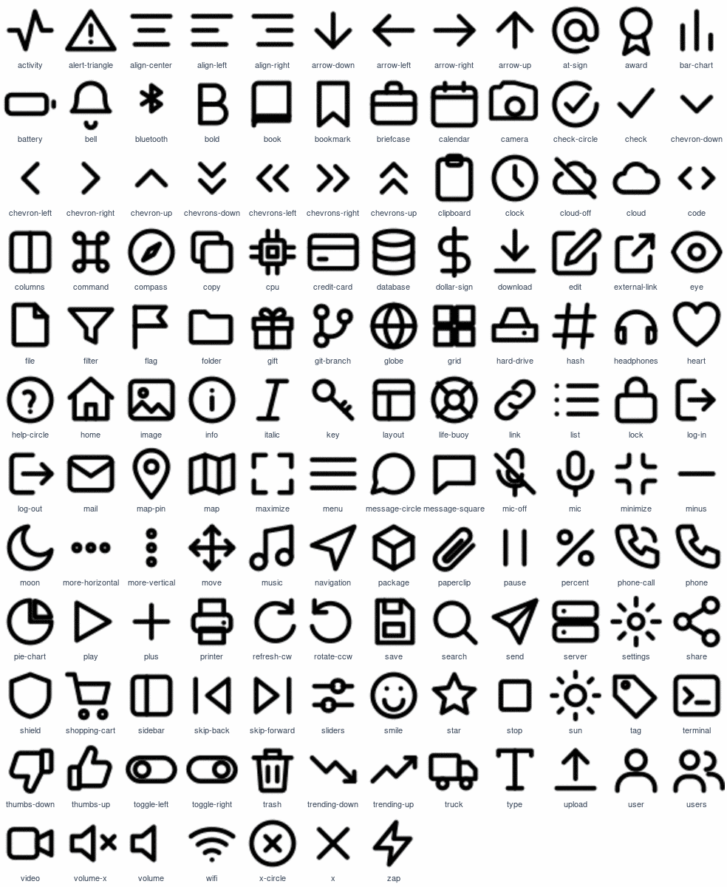

## Patterns (20)

Tileable SVG backgrounds. Set a `color` on the element to tint them, then `background-image: url("assets/patterns/NAME.svg")` with `background-repeat: repeat`.

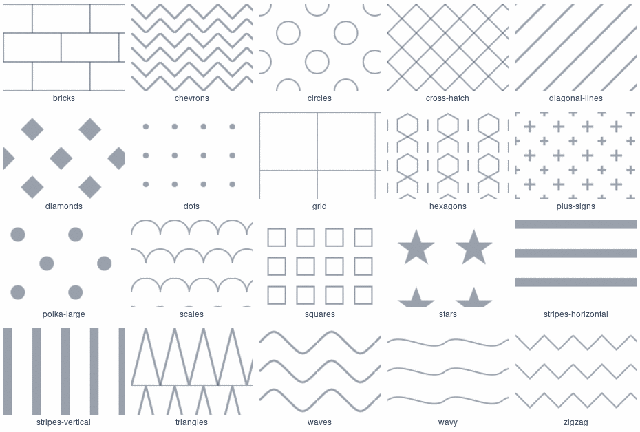

## Illustrations (18)

Flat spot illustrations on a 400 by 300 canvas for empty, error and success states.

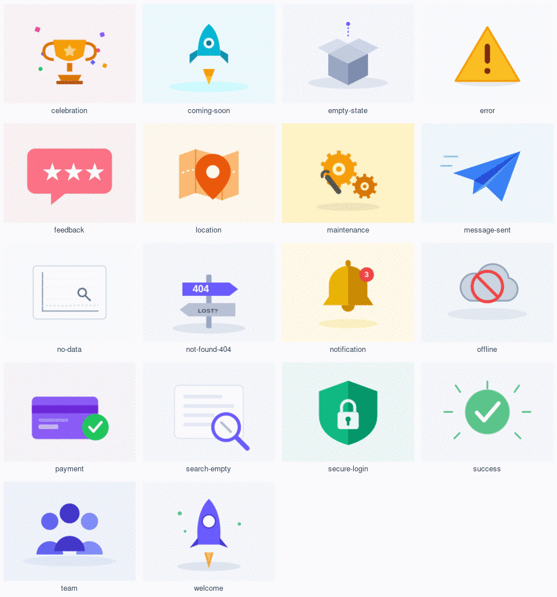

## Animations (34)

Self-contained loaders and micro-animations. The GIFs below are previews; the shipped files are lightweight CSS and SVG that honor `prefers-reduced-motion`. Open [`gallery.html`](gallery.html) to see them run in real CSS, or copy a file's `<style>` and markup.

<table>
<tr><td align="center">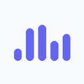<br><sub>bars-equalizer</sub></td><td align="center"><br><sub>bell-shake</sub></td><td align="center">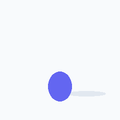<br><sub>bouncing-ball</sub></td><td align="center">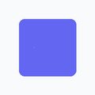<br><sub>checkbox-tick</sub></td><td align="center"><br><sub>circular-progress</sub></td><td align="center">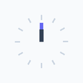<br><sub>clock-spinner</sub></td></tr>
<tr><td align="center">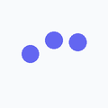<br><sub>dots</sub></td><td align="center"><br><sub>dual-ring</sub></td><td align="center">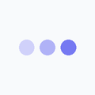<br><sub>ellipsis</sub></td><td align="center">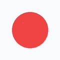<br><sub>error-cross</sub></td><td align="center">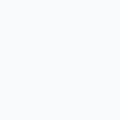<br><sub>fade-in-up</sub></td><td align="center">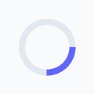<br><sub>gradient-ring</sub></td></tr>
<tr><td align="center"><br><sub>heart-beat</sub></td><td align="center">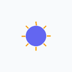<br><sub>like-burst</sub></td><td align="center">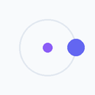<br><sub>orbit</sub></td><td align="center"><br><sub>pop-in</sub></td><td align="center">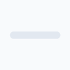<br><sub>progress-bar</sub></td><td align="center"><br><sub>pulse-circle</sub></td></tr>
<tr><td align="center">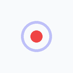<br><sub>pulse-dot</sub></td><td align="center"><br><sub>ripple</sub></td><td align="center">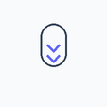<br><sub>scroll-hint</sub></td><td align="center">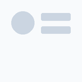<br><sub>skeleton-avatar</sub></td><td align="center"><br><sub>skeleton-list</sub></td><td align="center">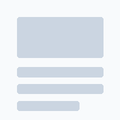<br><sub>skeleton-shimmer</sub></td></tr>
<tr><td align="center">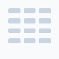<br><sub>skeleton-table</sub></td><td align="center">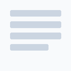<br><sub>skeleton-text</sub></td><td align="center"><br><sub>spinner</sub></td><td align="center">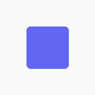<br><sub>square-flip</sub></td><td align="center">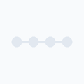<br><sub>step-progress</sub></td><td align="center">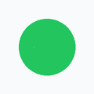<br><sub>success-check</sub></td></tr>
<tr><td align="center">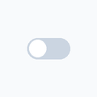<br><sub>toggle-switch</sub></td><td align="center"><br><sub>typing-indicator</sub></td><td align="center">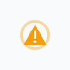<br><sub>warning-pulse</sub></td><td align="center">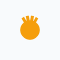<br><sub>wave-hand</sub></td></tr>
</table>

## Templates (6)

Starting points you adapt, not drop in verbatim. Open each in [`gallery.html`](gallery.html) or from the table.

| Template | Files |
|----------|-------|
| [`contact`](templates/contact/index.html) | index.html, styles.css |
| [`dashboard`](templates/dashboard/index.html) | index.html, styles.css |
| [`landing`](templates/landing/index.html) | index.html, styles.css |
| [`pricing`](templates/pricing/index.html) | index.html, styles.css |
| [`react-card`](templates/react-card/) | Card.css, Card.jsx |
| [`react-modal`](templates/react-modal/) | Modal.css, Modal.jsx |

## Using an icon

```html

```

## Using a pattern

```css
.section {
  color: #64748b;                                  /* tints the pattern */
  background-image: url("assets/patterns/dots.svg");
  background-repeat: repeat;
}
```

## License

The icons, patterns, illustrations and animations are dedicated to the public domain under CC0 1.0: use, modify and redistribute them freely, no attribution required. The templates are released under the MIT License. See [`LICENSE`](LICENSE). Nothing here is derived from a third-party asset set.
